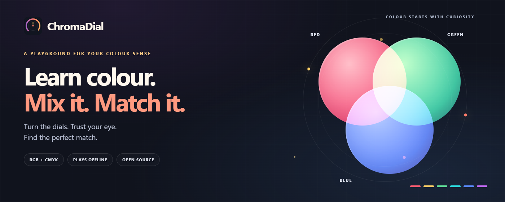
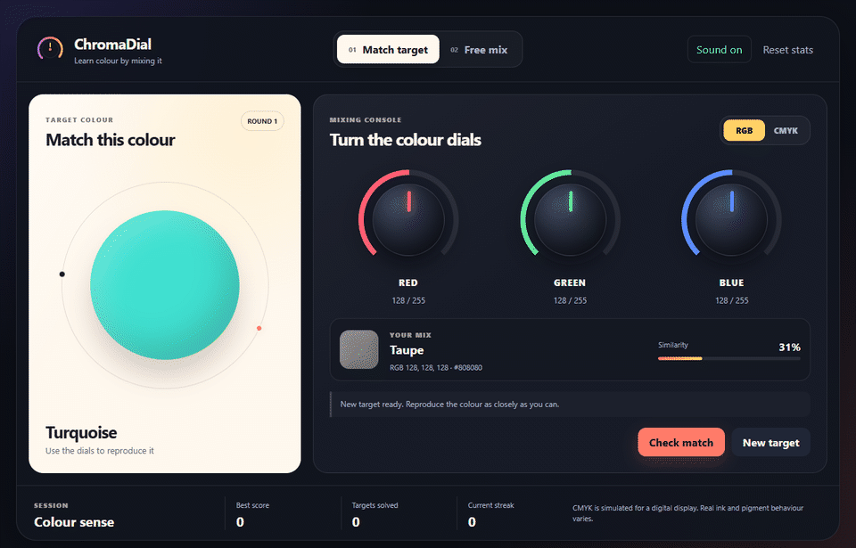
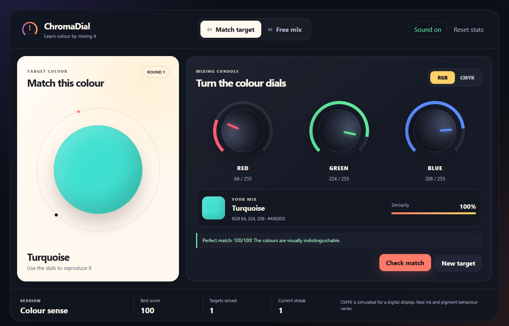

  

  A hands-on colour-mixing game. Turn the dials, train your eye, and find the perfect match.

<!-- The browser link becomes available once GitHub Pages is enabled: main / (root). -->

  <a href="https://prabs25.github.io/Chromadial/ChromaDial/"><strong>Play in browser</strong></a>
  &nbsp; · &nbsp;
  <a href="https://github.com/PRABS25/Chromadial/raw/refs/heads/main/downloads/ChromaDial.zip"><strong>Download &amp; play offline</strong></a>
  &nbsp; · &nbsp;
  <a href="https://github.com/PRABS25/Chromadial#how-to-play">How to play</a>

## See it in action

From a grey starting mix to a perfect turquoise match, one dial at a time.

View the full game screenshot

## Two ways to explore colour

| Match target | Free mix |
| --- | --- |
| Recreate a target colour and check how close you are. | Mix freely and discover the nearest recognised colour name. |
| Get a similarity score and a hint about what to adjust. | See RGB or CMYK values and the hex colour code as you turn the dials. |
| Build a streak and celebrate a perfect match with fireworks. | Switch between RGB and simulated CMYK to explore both models. |

## How to play

1. Choose **Match target** and select **RGB** or **CMYK**.
2. Turn the dials until your mix resembles the target. Drag up or down, use the mouse wheel, or focus a dial and press the arrow keys.
3. Select **Check match** for your score, a hint, and a result sound.
4. A score of **97% or higher** solves the target. **100%** triggers the fireworks. Select **New target** for another round.

Use **Free mix** whenever you want to experiment without a target. The **Sound on/off** button lets you choose whether to hear result sounds.

More dial controls

- **Shift + mouse wheel / arrow keys:** larger adjustments.
- **Home:** set the focused dial to its minimum.
- **End:** set the focused dial to its maximum.

## Play offline

1. [Download the game](https://github.com/PRABS25/Chromadial/raw/refs/heads/main/downloads/ChromaDial.zip) and extract the ZIP. This download contains only the **ChromaDial** game folder.
2. Open the **ChromaDial** folder, then open **index.html** in your browser.
3. On Windows, you can also open the **ChromaDial** folder and double-click **Launch ChromaDial.cmd** for an app-style window.

No installation or build step is required. Keep the extracted files and folders together. The game works offline after download; your best score, solved targets, streak, and sound preference are saved locally when browser storage is available.

## Make it yours

To change the sounds, edit **SOUND_SETTINGS** near the top of [ChromaDial/js/sound-effects.js](ChromaDial/js/sound-effects.js). Adjust the volume, notes, or waveform, then save and reopen the game.

To change the passing score, update the two `score >= 97` checks in [ChromaDial/js/app.js](ChromaDial/js/app.js). Keep the `score === 100` check for the perfect-match celebration.

## Under the hood

Built with **HTML, CSS, and JavaScript**, with browser-generated audio and a canvas fireworks effect. Colour similarity uses **CIE Lab Delta E 2000** to compare how colours are perceived.

CMYK is simulated on a digital display. Real ink, paper, and pigment can behave differently.

## License

[MIT License](ChromaDial/LICENSE) · Created by [Prabs](https://github.com/PRABS25).

